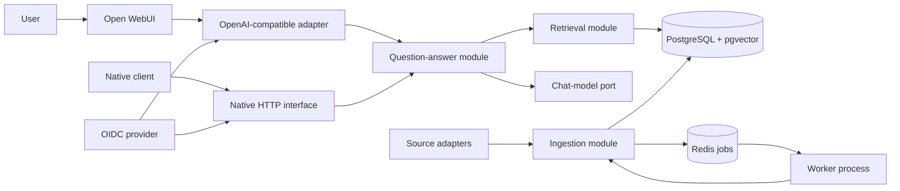
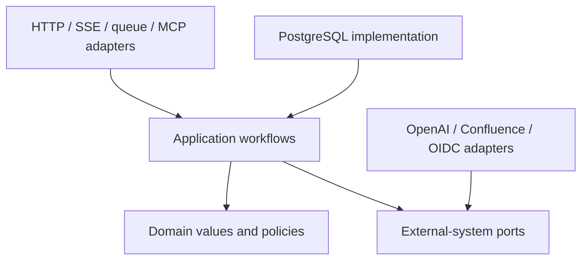
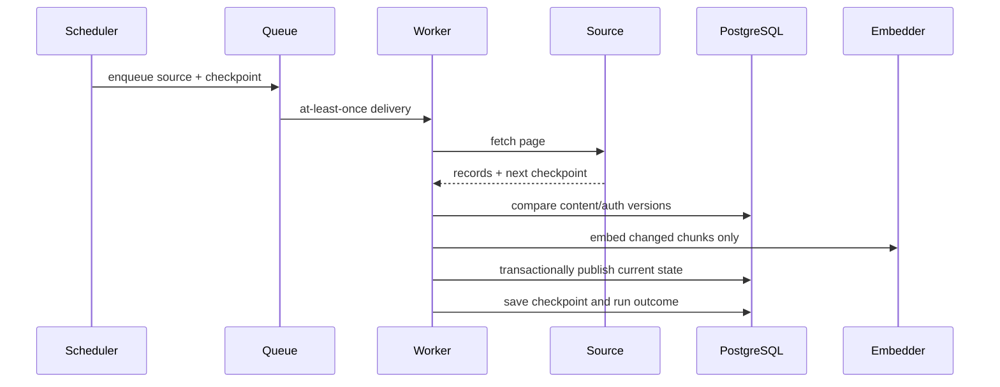
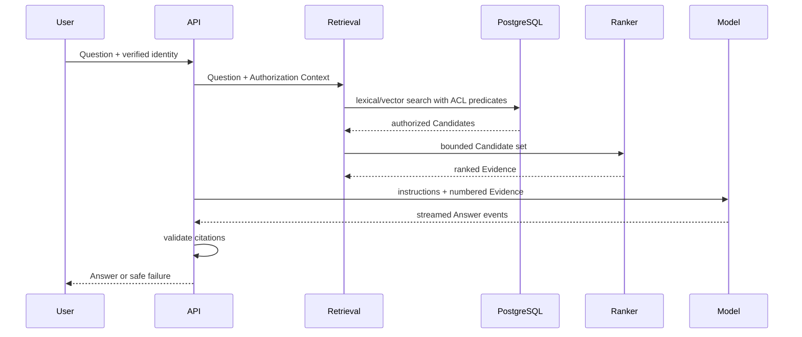

# Architecture

## Shape

The system is a modular monolith: one repository and one domain model, deployed as an API process and one or more worker processes. This is a distribution choice, not permission for domain logic to leak into HTTP routes or queue handlers.

## Deep modules and seams

A module earns its interface by hiding meaningful behavior and invariants. Tests and callers use the same interface.

| Module | Interface promises | Hidden implementation |
|---|---|---|
| Source synchronization | Start/resume a run and report an outcome | pagination, checkpoints, retries, version comparison, tombstones |
| Document normalization | Convert a Source Record into a Document | format parsing, sanitization, structural metadata, language detection |
| Indexing | Reconcile one Document with searchable state | chunk replacement, embedding batches, lexical vectors, ACL updates |
| Retrieval | Return authorized ranked Candidates | ACL predicates, dense/lexical queries, fusion, reranking, budgets |
| Question answering | Produce an Answer or Abstention | history rewriting, token budgeting, evidence formatting, citation validation |
| Evaluation | Execute an Evaluation Dataset and emit comparable results | concurrency, caching policy, scorers, judge calls, artifacts |

Use a port at a seam for true external systems: model providers, Confluence, identity, and optional external search. Each port must have a production adapter and a deterministic test adapter. PostgreSQL is tested through real PostgreSQL in integration tests rather than hidden behind a repository interface for every query.

## Dependency direction

Domain values do not import FastAPI, Dramatiq, SQLAlchemy, OpenAI SDKs, or LangGraph. Transport adapters translate protocol data into application requests and translate results back. The OpenAI-compatible interface adapts to the same question-answer module as the native interface.

## Runtime flows

### Synchronization

### Answering

## Deliberate exclusions from the default path

- LangGraph and multi-agent orchestration do not replace ordinary question answering.
- MCP is an additional protocol adapter, not the owner of search logic.
- Redis is not the durable record for conversations, jobs, or Documents.
- Generated-answer caching is excluded until permission and staleness behavior is proven.
- Kubernetes does not change application module interfaces.
