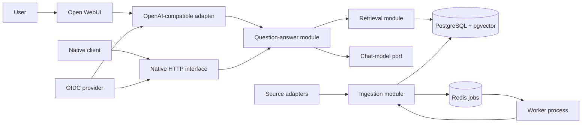
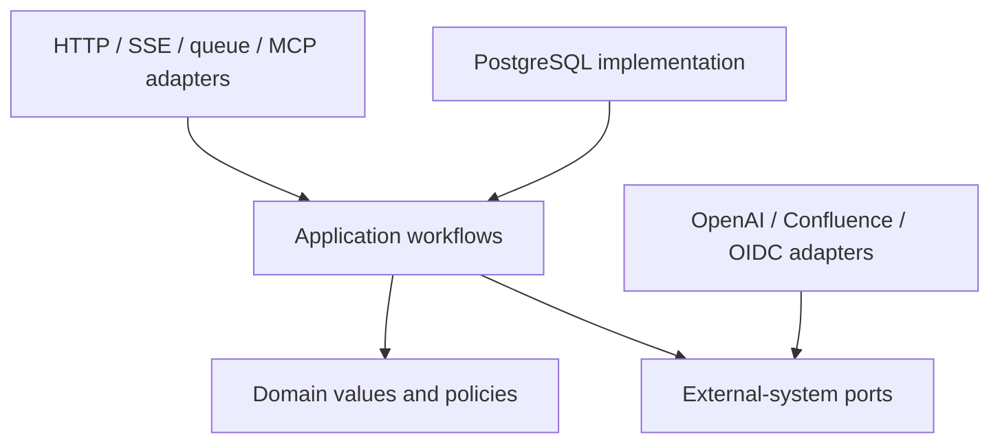
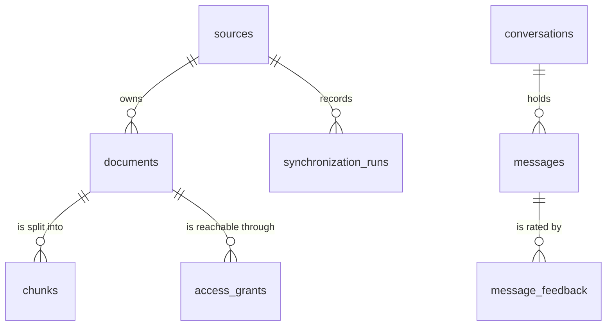
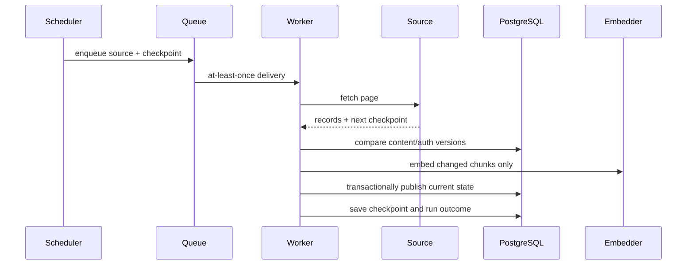
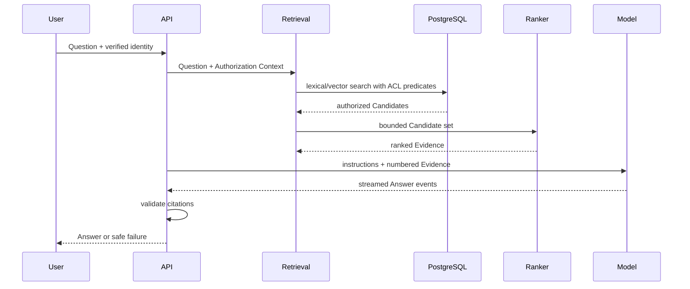

# Architecture

## Shape

The system is a modular monolith: one repository and one domain model, deployed as an API process and one or more worker processes. This is a distribution choice, not permission for domain logic to leak into HTTP routes or queue handlers.

```mermaid
flowchart LR
    U[User] --> W[Open WebUI]
    W --> C[OpenAI-compatible adapter]
    A[Native client] --> N[Native HTTP interface]
    C --> Q[Question-answer module]
    N --> Q
    Q --> R[Retrieval module]
    R --> P[(PostgreSQL + pgvector)]
    Q --> M[Chat-model port]
    S[Source adapters] --> I[Ingestion module]
    I --> P
    I --> X[(Redis jobs)]
    X --> K[Worker process]
    K --> I
    ID[OIDC provider] --> N
    ID --> C
```

## Deep modules and seams

A module earns its interface by hiding meaningful behavior and invariants. Tests and callers use the same interface.

| Module | Interface promises | Hidden implementation |
|---|---|---|
| Source synchronization | Start/resume a run and report an outcome | pagination, checkpoints, retries, version comparison, tombstones |
| Document normalization | Convert a Source Record into a Document | format parsing, sanitization, structural metadata, language detection |
| Indexing | Reconcile one Document with searchable state | chunk replacement, embedding batches, lexical vectors, ACL updates |
| Retrieval | Return authorized ranked Candidates | ACL predicates, dense/lexical queries, fusion, reranking, budgets |
| Question answering | Produce an Answer or Abstention | history rewriting, token budgeting, evidence formatting, citation validation |
| Evaluation | Execute an Evaluation Dataset and emit comparable results | concurrency, caching policy, scorers, judge calls, artifacts |

Use a port at a seam for true external systems: model providers, Confluence, identity, and optional external search. Each port must have a production adapter and a deterministic test adapter. PostgreSQL is tested through real PostgreSQL in integration tests rather than hidden behind a repository interface for every query.

## Dependency direction

```mermaid
flowchart TD
    Transport[HTTP / SSE / queue / MCP adapters] --> Application[Application workflows]
    Application --> Domain[Domain values and policies]
    Application --> Ports[External-system ports]
    Adapters[OpenAI / Confluence / OIDC adapters] --> Ports
    Persistence[PostgreSQL implementation] --> Application
```

Domain values do not import FastAPI, Dramatiq, SQLAlchemy, OpenAI SDKs, or LangGraph. Transport adapters translate protocol data into application requests and translate results back. The OpenAI-compatible interface adapts to the same question-answer module as the native interface.

## Data model

Every row is named by an opaque identifier it keeps for its whole life:
`source_id`, `document_id`, `chunk_id`, `conversation_id`, `message_id`,
`run_id`, `job_id`, `event_id`, `grant_id`. Nothing is identified by a natural
key or a position, so identity survives a rename, a move, or a re-ingest.

A Document carries two versions that move independently. `content_version` rises
when its text changes, and `authorization_version` rises when who may read it
changes. Chunks record the `content_version` they were written from, and a
publication refuses a Chunk run that disagrees with the Document or that is older
than the one already stored. An authorization change therefore leaves the content
version alone, so the same text is never split again; a content change is the
only thing that produces a different Chunk run.

```mermaid
erDiagram
    sources ||--o{ documents : "owns"
    sources ||--o{ synchronization_runs : "records"
    documents ||--o{ chunks : "is split into"
    documents ||--o{ access_grants : "is reachable through"
    conversations ||--o{ messages : "holds"
    messages ||--o{ message_feedback : "is rated by"
```

The rules each table enforces:

| Table | Rule |
|---|---|
| `sources` | One Source per `(kind, location)`. |
| `synchronization_runs` | A Source has at most one run in flight; a finished run leaves the way clear for the next. |
| `documents` | One Document per `(source_id, external_id)`; `content_version >= 1`; availability is `available` or `tombstoned`. |
| `chunks` | One Chunk per `(document_id, ordinal)`; `token_count >= 1`; a Chunk's `content_version` is at least 1. |
| `access_grants` | One Grant per `(document_id, subject_kind, subject_id)`; a `public` Grant carries no subject and every other kind carries one. |
| `conversations` | `retention_deadline > created_at`; `last_message_at >= created_at`. |
| `messages` | One Message per `(conversation_id, ordinal)`. |
| `message_feedback` | One rating per `(message_id, user_id)`, replaced when the same User rates again. |
| `jobs` | A status that agrees with the timestamps it carries; a bounded attempt count; a capped error code. |
| `audit_events` | No raw content, and a metadata bag capped at 1024 bytes. |
| `evaluation_runs` | An artifact location only once the run has succeeded. |

A rule that spans rows of one table, such as one running Synchronization Run per
Source, is enforced by a partial unique index rather than a check constraint,
because a check constraint can only see the row it is written on.

## Runtime flows

### Synchronization

```mermaid
sequenceDiagram
    participant Scheduler
    participant Queue
    participant Worker
    participant Source
    participant DB as PostgreSQL
    participant Embedder
    Scheduler->>Queue: enqueue source + checkpoint
    Queue->>Worker: at-least-once delivery
    Worker->>Source: fetch page
    Source-->>Worker: records + next checkpoint
    Worker->>DB: compare content/auth versions
    Worker->>Embedder: embed changed chunks only
    Worker->>DB: transactionally publish current state
    Worker->>DB: save checkpoint and run outcome
```

### Answering

```mermaid
sequenceDiagram
    participant User
    participant API
    participant Retrieval
    participant DB as PostgreSQL
    participant Ranker
    participant Model
    User->>API: Question + verified identity
    API->>Retrieval: Question + Authorization Context
    Retrieval->>DB: lexical/vector search with ACL predicates
    DB-->>Retrieval: authorized Candidates
    Retrieval->>Ranker: bounded Candidate set
    Ranker-->>Retrieval: ranked Evidence
    API->>Model: instructions + numbered Evidence
    Model-->>API: streamed Answer events
    API->>API: validate citations
    API-->>User: Answer or safe failure
```

## Deliberate exclusions from the default path

- LangGraph and multi-agent orchestration do not replace ordinary question answering.
- MCP is an additional protocol adapter, not the owner of search logic.
- Redis is not the durable record for conversations, jobs, or Documents.
- Generated-answer caching is excluded until permission and staleness behavior is proven.
- Kubernetes does not change application module interfaces.
