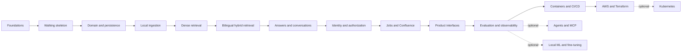

# Dependency roadmap

The plan contains **238 tasks**. The **192-task critical path is approximately 268.75 estimated hours**; the **46 optional tasks add approximately 65.5 hours**. The full plan is approximately **334.25 hours**, fitting the selected twelve-week, 20–30 hour/week range only at the intensive end. Estimates include focused reading and implementation but real debugging may move work into the overflow window.

## Milestone graph

## Critical path

| Milestone | Tasks | Estimate | Entry | Gate |
|---|---:|---:|---|---|
| [M00 Foundations](milestones/M00-foundations/README.md) | 14 | 16h 15m | [M00-T01](milestones/M00-foundations/M00-T01-record-the-workspace-baseline.md) | [M00-T14](milestones/M00-foundations/M00-T14-pass-the-foundations-gate.md) |
| [M01 Walking skeleton](milestones/M01-walking-skeleton/README.md) | 12 | 15h 45m | [M01-T01](milestones/M01-walking-skeleton/M01-T01-serve-liveness-and-readiness.md) | [M01-T12](milestones/M01-walking-skeleton/M01-T12-pass-the-walking-skeleton-gate.md) |
| [M02 Domain and persistence](milestones/M02-domain-and-persistence/README.md) | 14 | 19h 45m | [M02-T01](milestones/M02-domain-and-persistence/M02-T01-model-stable-domain-identifiers.md) | [M02-T14](milestones/M02-domain-and-persistence/M02-T14-pass-the-persistence-gate.md) |
| [M03 Local ingestion](milestones/M03-local-ingestion/README.md) | 14 | 20h | [M03-T01](milestones/M03-local-ingestion/M03-T01-design-the-source-port.md) | [M03-T14](milestones/M03-local-ingestion/M03-T14-pass-the-local-ingestion-gate.md) |
| [M04 Dense retrieval](milestones/M04-dense-retrieval/README.md) | 12 | 17h | [M04-T01](milestones/M04-dense-retrieval/M04-T01-design-the-embedding-model-port.md) | [M04-T12](milestones/M04-dense-retrieval/M04-T12-pass-the-dense-retrieval-gate.md) |
| [M05 Bilingual hybrid retrieval](milestones/M05-bilingual-hybrid-retrieval/README.md) | 16 | 22h 45m | [M05-T01](milestones/M05-bilingual-hybrid-retrieval/M05-T01-index-english-full-text-search.md) | [M05-T16](milestones/M05-bilingual-hybrid-retrieval/M05-T16-pass-the-hybrid-retrieval-gate.md) |
| [M06 Answers and conversations](milestones/M06-answers-and-conversations/README.md) | 14 | 20h 15m | [M06-T01](milestones/M06-answers-and-conversations/M06-T01-model-evidence-and-citations.md) | [M06-T14](milestones/M06-answers-and-conversations/M06-T14-pass-the-answering-gate.md) |
| [M07 Identity and authorization](milestones/M07-identity-and-authorization/README.md) | 16 | 23h 15m | [M07-T01](milestones/M07-identity-and-authorization/M07-T01-write-the-system-threat-model.md) | [M07-T16](milestones/M07-identity-and-authorization/M07-T16-pass-the-authorization-gate.md) |
| [M08 Jobs and Confluence](milestones/M08-jobs-and-confluence/README.md) | 16 | 22h 45m | [M08-T01](milestones/M08-jobs-and-confluence/M08-T01-introduce-dramatiq-and-redis.md) | [M08-T16](milestones/M08-jobs-and-confluence/M08-T16-pass-the-jobs-and-confluence-gate.md) |
| [M09 Product interfaces](milestones/M09-product-interfaces/README.md) | 12 | 16h 15m | [M09-T01](milestones/M09-product-interfaces/M09-T01-design-native-resource-routes.md) | [M09-T12](milestones/M09-product-interfaces/M09-T12-pass-the-product-interface-gate.md) |
| [M10 Evaluation and observability](milestones/M10-evaluation-and-observability/README.md) | 18 | 26h | [M10-T01](milestones/M10-evaluation-and-observability/M10-T01-version-evaluation-datasets.md) | [M10-T18](milestones/M10-evaluation-and-observability/M10-T18-pass-the-evaluation-and-observability-gate.md) |
| [M12 Containers and CI/CD](milestones/M12-containers-and-cicd/README.md) | 16 | 23h 15m | [M12-T01](milestones/M12-containers-and-cicd/M12-T01-build-a-minimal-api-image.md) | [M12-T16](milestones/M12-containers-and-cicd/M12-T16-pass-the-container-and-cicd-gate.md) |
| [M13 AWS and Terraform](milestones/M13-aws-and-terraform/README.md) | 18 | 25h 30m | [M13-T01](milestones/M13-aws-and-terraform/M13-T01-install-and-pin-infrastructure-tools.md) | [M13-T18](milestones/M13-aws-and-terraform/M13-T18-pass-the-aws-and-terraform-gate.md) |

## Optional branches

| Milestone | Unlocked by | Tasks | Estimate | Decision produced |
|---|---|---:|---:|---|
| [M11 Agents and MCP](milestones/M11-agents-and-mcp/README.md) | M10-T18 | 16 | 23h | Whether bounded agent/multi-agent workflows beat deterministic RAG |
| [M14 Kubernetes](milestones/M14-kubernetes/README.md) | M13-T18 | 14 | 19h 45m | When Kubernetes is preferable to ECS for this system |
| [M15 Local ML and fine-tuning](milestones/M15-local-ml-and-fine-tuning/README.md) | M10-T18 | 16 | 22h 45m | Whether local serving or QLoRA beats managed models/prompting/RAG |

## Capacity rule

At 20 hours/week, complete the critical path and treat some reading, human review, and cloud troubleshooting as overflow. At 25 hours/week, complete the critical path with contingency. At 30 hours/week, the full plan is arithmetically possible but only if paid infrastructure and bilingual reviewers are available when needed. Never combine tasks merely to satisfy a calendar; move an optional branch instead.

## Parallelism rule

The learner implements one task at a time. External waiting—human review, paid evaluation, cloud provisioning—may overlap only when the second task does not depend on the unsettled result. The `depends_on` front matter is authoritative.
