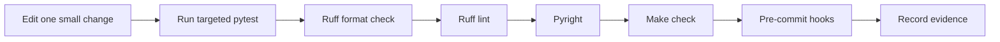

# M00-T14 — Foundations gate evidence

Completed: 2026-09-23

## Invariant

The repository must keep a deterministic edit-test-quality loop, with
configuration failures reported at the configuration boundary before any
application workflow or external system is called.

## Toolchain and package layout

`uv` manages the locked Python 3.14 environment and dependencies. Application
code lives in `src/knowledge_service`, tests live in `tests`, and documentation
and evidence live under `docs`. Ruff formats and lints, Pyright checks types,
pytest runs deterministic tests, and pre-commit repeats the local quality
checks before commits.

## Development loop



## Injected configuration failure

With `KNOWLEDGE_SERVICE_ENVIRONMENT=production` and no model API key,
`Settings()` raises `ValueError` with `MODEL_API_KEY is required in
production`. The failure belongs to configuration validation: the production
policy is enforced before transport, persistence, or application workflows
can run. Local and test environments remain usable without that credential.

## Small independent check

Added `test_test_environment_does_not_require_model_api_key`, which verifies
that the test environment can be constructed without production credentials.

## Verification

```text
$ UV_CACHE_DIR=/tmp/uv-cache-rag-project uv run pytest tests/test_settings.py
5 passed

$ UV_CACHE_DIR=/tmp/uv-cache-rag-project make check
15 passed, 1 deselected

$ UV_CACHE_DIR=/tmp/uv-cache-rag-project make hooks
all hooks passed
```

No provider payloads, secrets, or private documents entered the repository.

## Reflection

- **What complexity did this task hide from its caller?** The settings model
  hides environment parsing, defaults, secret handling, and production-only
  validation behind one typed boundary.
- **Which alternative would make the next change harder, and why?** Letting
  each workflow read environment variables directly would duplicate policy and
  make tests depend on machine state.
- **What production failure would escape if the negative test were removed?**
  A production deployment could start without its required model credential and
  fail later at an external call instead of during startup validation.
