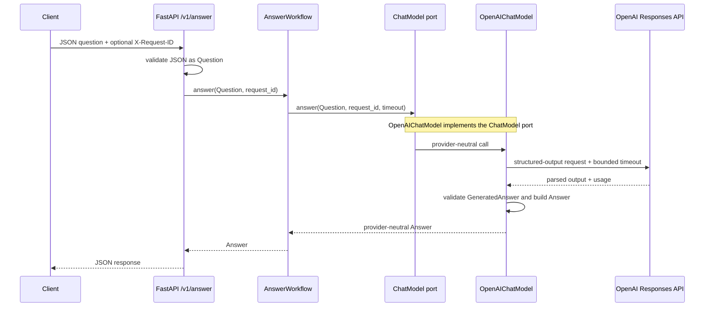

# M01-T12 — Walking-skeleton understanding gate evidence

Completed: 2026-10-02

## Invariant

Every `ChatModel` returns the provider-neutral `Answer` with the caller's
request ID and safe `Usage`, reports model failures as `ChatModelError`, and
propagates caller cancellation as `asyncio.CancelledError`.

## Seam explanation and request flow

The learner explained that FastAPI validates the incoming JSON as a `Question`,
then passes it to `AnswerWorkflow`. The workflow calls the `ChatModel` port,
which is implemented here by `OpenAIChatModel`. The adapter sends the question
and bounded request settings to OpenAI, parses the structured result as
`GeneratedAnswer`, maps it into the provider-neutral `Answer`, and returns it
through the workflow. FastAPI serializes that answer as JSON for the caller.

The workflow owns the whole-operation deadline. The model port hides which
provider implements the call. The OpenAI adapter owns SDK-specific request and
response details. The HTTP layer and error policy own request IDs, public
status codes, and safe client messages. `FakeChatModel` implements the same
port for deterministic tests.

## Simulated provider-timeout diagnosis

The deterministic adapter test injects an `openai.APITimeoutError`, which
`OpenAIChatModel` converts to `ChatModelTimeout`. If the workflow's own deadline
expires, `AnswerWorkflow` raises `AnswerDeadlineExceeded` instead. The HTTP
failure policy classifies either typed error as a dependency failure and returns
`503 dependency_unavailable`; it does not expose the provider's raw message.

The learner confirmed this distinction and the shared public response. Their
reflection on the negative test was: “The app may return incorrect error to the
caller.” The missing-summary test protects the adapter's translation of invalid
structured data into `ChatModelMalformedResponse`, so the app can apply its
stable failure policy.

## Structured-field change

Added a required `summary` string, bounded to 1–280 characters, to both
`GeneratedAnswer` and `Answer`. The OpenAI adapter copies the validated value
into `Answer`; test fakes and provider fixtures provide it. Tests cover exact
adapter mapping, empty-summary validation, missing-summary typed failure,
shared `ChatModel` contract behavior, and the native HTTP JSON response.

| File | Change |
|---|---|
| `src/knowledge_service/contracts.py` | Added the bounded `summary` field to both answer contracts. |
| `src/knowledge_service/openai_model.py` | Maps the parsed summary into `Answer`. |
| `tests/fakes.py` | Supplies a deterministic summary from both fake models. |
| `tests/test_openai_model.py` | Covers mapping, empty summary, and missing-summary failure. |
| `tests/test_chat_model_contract.py` | Requires a non-empty summary from each adapter. |
| `tests/test_app.py` | Checks summary in the HTTP response JSON. |
| `docs/lessons/M01-T12-pass-the-walking-skeleton-gate.md` | Provides the learner's step-by-step guide. |
| `docs/evidence/M01-T12-walking-skeleton-gate.md` | Records gate explanations, behavior, and verification. |

## Verification

- `UV_CACHE_DIR=/tmp/uv-cache-rag-project uv run pytest tests/test_openai_model.py tests/test_workflow.py tests/test_app.py tests/test_chat_model_contract.py` — 44 passed, 1 deselected.
- `UV_CACHE_DIR=/tmp/uv-cache-rag-project make check` — Ruff formatting and lint passed; Pyright reported 0 errors, 0 warnings, 0 informations; 89 passed, 2 deselected; total coverage 93%.
- `UV_CACHE_DIR=/tmp/uv-cache-rag-project make docs-check` — passed.
- `UV_CACHE_DIR=/tmp/uv-cache-rag-project make hooks` — all hooks passed, including whitespace, secret scanning, formatting, lint, type checking, and deterministic tests.
- `git diff --cached --check` and `git diff --check` — passed.

No live provider call was made. The tests use synthetic values, including the
redacted `test-key` fixture. The learner confirmed that no real credentials,
private content, or raw provider responses entered the changes or evidence.

## Reflection

- **What complexity did this task hide from its caller?** “It manages different resources' timeouts and hides from the caller the complexity of handling a large number of errors.”
- **Which alternative would make the next change harder, and why?** The learner noted that not having an error taxonomy would increase error handling; callers would need to handle more error cases themselves.
- **What production failure would escape if your negative test were removed?** “The app may return incorrect error to the caller.” A malformed provider result without a summary could escape the adapter's typed failure translation and receive inconsistent public handling.

The learner confirmed the corrected explanation of the request flow and timeout
mapping during the completion review. The initial pre-change prediction was not
recorded before implementation.
