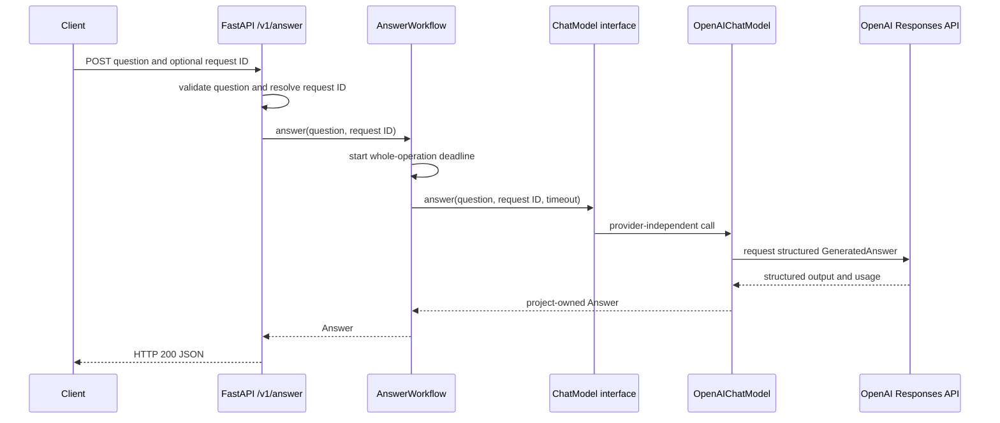

# M01-T12 — Pass the walking-skeleton understanding gate

Source task: [M01-T12](../curriculum/milestones/M01-walking-skeleton/M01-T12-pass-the-walking-skeleton-gate.md)

## What you will do

This lesson includes coding. You will first trace the question-to-answer path
you built in M01 and explain where each part of the system does its work. Then
you will add a short `summary` field from the model's structured output all the
way to the HTTP response. This small change checks that the boundaries between
the API, workflow, model interface, and provider adapter fit together.

The original task above remains the acceptance source. This guide walks you
through it in order; write explanations and reflections in your own words.

## Before you begin

M01-T11 established this rule: every `ChatModel` returns the same
provider-neutral `Answer`, preserves the caller's request ID, includes safe
usage data, reports model errors through project-owned exception types, and
passes cancellation through. The new field must preserve that rule. An OpenAI
SDK response object or error should stay inside the OpenAI adapter.

The key pieces are already in the project:

- `create_app()` in `src/knowledge_service/app.py` receives and returns HTTP
  data, sets request IDs, and maps errors to safe responses.
- `AnswerWorkflow` in `src/knowledge_service/workflow.py` puts a time limit on
  the whole operation and calls the `ChatModel` interface.
- `ChatModel` in `src/knowledge_service/model.py` is the promise an adapter
  must keep: accept a `Question` and return an `Answer`.
- `OpenAIChatModel` in `src/knowledge_service/openai_model.py` speaks to the
  provider and converts its output and errors into project-owned types.
- `FakeChatModel` in `tests/fakes.py` keeps tests on the same interface without
  contacting a provider.

For background, the task points to the [task execution guide](../curriculum/TASK-GUIDE.md),
[architecture overview](../architecture.md), [domain language](../../CONTEXT.md),
and [primary-source map](../research/primary-sources.md). In particular, the
architecture diagram shows later retrieval and citation work too; your diagram
for this lesson should show only the behavior that exists in M01 today.

## Walkthrough

### Step 1 — Set down what you expect to happen *(No coding in this step)*

**Why:** Before changing the shared answer contract, make a note of the rule
you are preserving and the failures you expect. That gives you something
concrete to compare with what the tests show.

**Choice:** Keep this task's notes in
`docs/evidence/M01-T12-walking-skeleton-gate.md`, the evidence location named
by the task. Do not record guessed test results; fill those in after running
the commands.

**Do this:** Read the M01-T11 evidence at
`docs/evidence/M01-T11-walking-skeleton-contract-tests.md`. In the new M01-T12
evidence file, write the invariant in your own words and predict what may fail
when `summary` becomes required but test fixtures still omit it. Then find the
current `Answer` and structured-output construction points:

```bash
rg -n 'Answer\(|output_parsed|GeneratedAnswer' src tests
```

**Check:** You have written down the existing invariant and expect that
Pydantic validation or a field assertion will reveal fixtures that lack the
new required value.

### Step 2 — Follow one request and one timeout *(No coding in this step)*

**Why:** A request crosses several parts of the app. Knowing who owns each
part makes it easier to place the new field and to tell where a failure should
be translated.

**Choice:** Explain the real M01 path in the evidence file and put the diagram
there. Keep it focused on today's API, workflow, model interface, and adapter.

**Do this:** Describe these jobs in your own words. The API validates the
question and resolves its request ID. The workflow controls the whole-operation
deadline. `ChatModel` is the provider-independent promise between the workflow
and an adapter. The OpenAI adapter makes the provider call and translates its
response. Finally, `classify_failure()` and `policy_for()` in
`src/knowledge_service/errors.py` decide which safe HTTP error the caller sees.
The fake model lets tests use the same promise without network access.

Draw this flow in the evidence file, checking the arrows against the code as
you go:



Now trace a provider timeout using the existing tests. In
`tests/test_openai_model.py`, `test_timeout_is_translated()` injects a
synthetic `openai.APITimeoutError`; `OpenAIChatModel.answer()` turns it into
`ChatModelTimeout`. The workflow lets that typed model error pass through. The
HTTP layer classifies it as a dependency failure and returns status `503` with
code `dependency_unavailable`. The raw provider error text is not sent to the
client.

Run the two deterministic checks:

```bash
uv run pytest tests/test_openai_model.py::test_timeout_is_translated -vv
uv run pytest tests/test_app.py -k 'answer_endpoint_maps_failures or answer_endpoint_returns_correct_response_on_timeout' -vv
```

There are two timeout cases to distinguish in your notes. A provider timeout
becomes `ChatModelTimeout`; expiry of the workflow's own deadline becomes
`AnswerDeadlineExceeded`. Both are project-owned failures by the time the HTTP
layer handles them.

**Check:** Your diagram matches the current code, and your timeout note names
the injected error, its translated exception, the HTTP status and code, and
why the provider's message stays private. Both commands pass without a live
provider call.

### Step 3 — Add the field at both boundaries *(Coding step)*

**Why:** The provider's structured result and the service's `Answer` are two
separate boundaries. Adding the field to both makes it clear that the service
requires it and gives the adapter a project-owned place to return it.

**Choice:** Add a required `summary` string of at most 280 characters to both
`GeneratedAnswer` and `Answer` in `src/knowledge_service/contracts.py`. The
same bounds keep empty or overly long summaries from becoming valid data.

**Do this:** Update the two models as follows. Keep the existing imports and
other fields; `Field` and `BaseModel` are already imported in this file.

```python
class Answer(BaseModel):
    """An answer in the knowledge service."""

    text: str
    summary: str = Field(min_length=1, max_length=280)
    request_id: UUID
    usage: Usage
    citations: list[str] = Field(default_factory=list)


class GeneratedAnswer(BaseModel):
    """Structured content returned by a chat model."""

    text: str = Field(min_length=1)
    summary: str = Field(
        min_length=1,
        max_length=280,
        description="A concise summary of the answer.",
    )
```

`GeneratedAnswer` is the structured content expected from the model.
`Answer` carries that content back through the app, along with the request ID
and usage information.

**Check:** Before fixing any callers, run the focused tests once:

```bash
uv run pytest tests/test_openai_model.py tests/test_workflow.py tests/test_app.py tests/test_chat_model_contract.py
```

Some tests should fail because existing `Answer` or generated-output fixtures
do not have `summary` yet. Compare what fails with your prediction. Keep the
field required and continue to the constructors that need updating.

### Step 4 — Pass the field through both model adapters *(Coding step)*

**Why:** The real adapter and the fake must keep the same `ChatModel` promise.
Otherwise tests could pass while the real provider path returns a different
shape.

**Choice:** Copy the validated summary in the OpenAI adapter, and use one
fixed summary in the fake. The workflow does not need special summary logic:
it already passes the complete `Answer` through.

**Do this:** In `src/knowledge_service/openai_model.py`, add the field to the
existing `Answer(...)` construction in `OpenAIChatModel.answer()`:

```python
return Answer(
    text=generated.text,
    summary=generated.summary,
    request_id=request_id,
    usage=Usage(
        # Keep the existing usage fields here.
    ),
)
```

In both `Answer(...)` constructions in `tests/fakes.py`, add:

```python
summary="A short fake summary.",
```

The fixed text satisfies the same answer contract in both the ordinary and
slow fake model. In `tests/test_openai_model.py` and
`tests/test_chat_model_contract.py`, update each successful parsed-response
fixture to include the extra field. For example:

```python
output_parsed=SimpleNamespace(
    text="The answer",
    summary="A concise summary",
)
```

Use the fixture's existing answer text where it differs. These namespaces
stand in for the parsed provider result in deterministic tests.

**Check:** Search again with `rg -n 'Answer\(|output_parsed|SimpleNamespace\(text' src tests`.
Every successful `Answer` construction and parsed-output fixture now supplies a
summary. The contracts, workflow, HTTP app, and fake still contain no
provider-specific imports.

### Step 5 — Test the new behavior at its boundaries *(Coding step)*

**Why:** The change needs to work for valid data and fail safely for invalid
data. Testing at the adapter, shared interface, and HTTP response shows that
the field crosses the whole path.

**Choice:** Keep the tests deterministic. Use the existing fake provider
boundary; test an empty summary as invalid, and test missing structured data
as a typed adapter failure.

**Do this:** In `tests/test_openai_model.py`, update
`test_success_maps_response_and_request_metadata()` to check the mapped value:

```python
assert result.summary == "A concise summary"
```

Update `test_generated_answer_requires_non_empty_text()` so valid structured
data has both fields, and cover empty text and empty summary:

```python
generated = GeneratedAnswer(
    text="A useful answer",
    summary="A concise summary",
)
assert generated.summary == "A concise summary"

with pytest.raises(ValidationError):
    GeneratedAnswer(text="", summary="A concise summary")

with pytest.raises(ValidationError):
    GeneratedAnswer(text="A useful answer", summary="")
```

Change `response_with_invalid_answer_error()` to create structured data with
the summary missing:

```python
GeneratedAnswer.model_validate({"text": "Answer without a summary"})
```

Keep `test_invalid_structured_data_raises_typed_failure()`. It proves the
validation error becomes `ChatModelMalformedResponse` inside the adapter.

In `tests/test_chat_model_contract.py`, add this assertion to
`assert_success_contract()`:

```python
assert answer.summary.strip()
```

In `tests/test_app.py`, update
`test_answer_endpoint_returns_answer()` to check the returned JSON:

```python
body = response.json()
assert body["request_id"] == REQUEST_ID
assert body["summary"] == "A short fake summary."
```

**Check:** Run each test boundary and confirm the assertions pass:

```bash
uv run pytest tests/test_openai_model.py -vv
uv run pytest tests/test_chat_model_contract.py -vv
uv run pytest tests/test_app.py::test_answer_endpoint_returns_answer -vv
```

Together, these checks prove the adapter maps the field, the contract rejects
bad structured data, the shared model interface requires it, and the HTTP
client receives it.

### Step 6 — Record what you proved and run the full checks *(No coding in this step)*

**Why:** The milestone gate needs evidence a reader can verify later. The
commands also check that the change fits the rest of the project.

**Choice:** Record only observed results in
`docs/evidence/M01-T12-walking-skeleton-gate.md`. Use the evidence file for
your diagram and explanation; the architecture overview describes the larger
future system as well.

**Do this:** Run the focused test set, then the repository checks:

```bash
uv run pytest tests/test_openai_model.py tests/test_workflow.py tests/test_app.py tests/test_chat_model_contract.py
make check
make docs-check
make hooks
git diff --check
```

In the evidence file, include the invariant, your seam explanations, the
request-flow diagram, the timeout diagnosis, the changed files and exact
verification results, and your answers to the three reflection questions in
the task. Add a brief security note confirming that the tests and evidence use
only synthetic values and contain no real credentials, private content, or
raw provider payloads.

**Check:** The focused tests and repository checks pass. `make check` runs
formatting checks, lint, type checking, and the default deterministic tests;
the opt-in live-provider test remains out of this lesson's test run. Your
evidence explains the design in your own words, not just the command results.

## Finish line

- [ ] I stated the M01-T11 invariant and kept it true.
- [ ] I explained who owns each part of the request and drew the current M01 flow.
- [ ] I traced a simulated provider timeout to the safe HTTP response.
- [ ] `summary` is required in `GeneratedAnswer` and `Answer` and is copied by
  the OpenAI adapter.
- [ ] The fake model, adapter fixtures, shared contract test, and HTTP test all
  include and check the new field.
- [ ] Tests cover successful mapping, invalid empty summary, and missing-summary
  typed failure.
- [ ] Focused tests, `make check`, `make docs-check`, hooks, and the diff check
  passed, with exact results recorded in evidence.
- [ ] I answered all three reflection questions and recorded the security check.

The next action is Step 1. If a test result differs from your prediction, share
the failure and the nearby code; we can trace that part of the path together.
