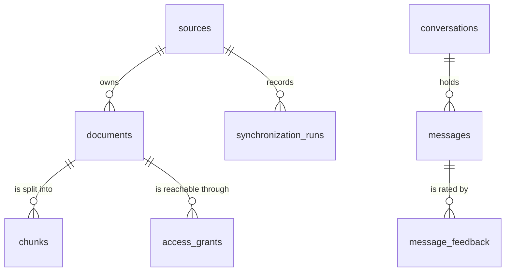

# M02-T14 — Pass the persistence understanding gate

Source task: [M02-T14](../curriculum/milestones/M02-domain-and-persistence/M02-T14-pass-the-persistence-gate.md)

## What you will do

This is the milestone gate. It is mostly writing and diagnosis, and one of its steps is deliberately broken.

- **Explain** version separation and transaction ownership in your own words, from the code you have.
- **Redraw the data model** so the diagram matches the eleven tables the migrations create.
- **Add one new invariant**: a Source has at most one Synchronization Run in flight.
- **Diagnose a defect** in the migration that adds that invariant. The lesson installs the defect, shows you the evidence that catches it, and stops there. The diagnosis and the repair are yours, because the acceptance for this gate is that the model decided the repair, not the error message.

## Before you begin

- The persistence layer is complete through M02-T13: eleven tables, every domain rule mirrored by a constraint, one transaction boundary, one shared database fixture per worker, and a drift check that compares the migrations against the declared tables.
- `alembic check` compares structure: tables, columns, indexes, and constraints. It cannot see a partial index predicate, which matters in Step 5.
- A migration that has already been applied does not run again. Repairing a migration file is not the same as repairing the database it produced.
- The deterministic suite and the pre-commit hooks skip the integration tests when `KNOWLEDGE_SERVICE_TEST_DATABASE_URL` is unset, so a defect that only PostgreSQL can show stays invisible to them.

## Walkthrough

### Step 1 — No coding in this step: write down the invariant

**Purpose:** Say what the milestone must preserve before adding anything to it.

**Decision:** Keep notes in `docs/evidence/M02-T14-persistence-gate.md`.

**Action:** Read the M02-T11 through M02-T13 evidence files. Create `docs/evidence/M02-T14-persistence-gate.md`:

```markdown
# M02-T14 — Persistence gate evidence

Completed: pending

## Invariant

Write down what the data model must keep true across every task in this
milestone: how identity, the two Document versions, and the transaction boundary
relate to each other.

## Prediction

Write what you expect the new invariant to refuse and what you expect it to
allow.

## Version separation

Pending.

## Transaction ownership

Pending.

## Injected migration failure

Pending.

## Verification

Pending.

## Reflection

Pending.
```

**Check:** The evidence file holds your invariant and prediction. Add no code and edit no task or progress files in this step.

### Step 2 — No coding in this step: explain the two ideas the milestone rests on

**Purpose:** The gate asks you to explain, not to run commands.

**Decision:** Answer in the evidence file, in your own words, with file and line references.

**Action:** Answer these, reading the code rather than the lessons:

**Version separation.** `documents` holds `content_version` and `authorization_version`; `chunks` holds `content_version`. What raises each version, and which one rewrites Chunks? Then answer: a Document whose grants changed but whose text did not is re-published — what happens to its Chunks, and where in `persistence.py` is that decided?

**Transaction ownership.** `publish_documents` opens the transaction and `publish_document` takes the connection. Say what would break if `replace_chunks` committed on its own, and what a reader would observe. Then answer: why does the model-provider call belong outside the transaction, and what would happen to a lock if it were inside?

**Check:** Both answers reference the code that implements them and describe an observable outcome, not an internal detail.

### Step 3 — Coding step: redraw the data model

**Purpose:** The architecture document has flow diagrams and no data model, so nothing records what the eleven tables mean together.

**Decision:** Add a `## Data model` section to `docs/architecture.md`: what an identity is, how the two Document versions move independently, one entity diagram, and the rule each table enforces. Place it before `## Runtime flows`, because the flows read better once the data is named.

**Action:** Add this section to `docs/architecture.md`:

```markdown
## Data model

Every row is named by an opaque identifier it keeps for its whole life:
`source_id`, `document_id`, `chunk_id`, `conversation_id`, `message_id`,
`run_id`, `job_id`, `event_id`, `grant_id`. Nothing is identified by a natural
key or a position, so identity survives a rename, a move, or a re-ingest.

A Document carries two versions that move independently. `content_version` rises
when its text changes, and `authorization_version` rises when who may read it
changes. Chunks record the `content_version` they were written from, so a
retrieval that reads a Chunk can tell whether the Document has moved on. An
authorization change therefore reuses every Chunk, and a content change is the
only thing that rewrites them.



The rules each table enforces:

| Table | Rule |
|---|---|
| `sources` | One Source per `(kind, location)`. |
| `synchronization_runs` | A Source has at most one run in flight; a finished run leaves the way clear for the next. |
| `documents` | One Document per `(source_id, external_id)`; `content_version >= 1`; availability is `available` or `tombstoned`. |
| `chunks` | One Chunk per `(document_id, ordinal)`; `token_count >= 1`; a Chunk's `content_version` is at least 1. |
| `access_grants` | One Grant per `(document_id, subject_kind, subject_id)`; a `public` Grant carries no subject and every other kind carries one. |
| `conversations` | `retention_deadline > created_at`; `last_message_at >= created_at`. |
| `messages` | One Message per `(conversation_id, ordinal)`. |
| `message_feedback` | One rating per `(message_id, user_id)`, replaced when the same User rates again. |
| `jobs` | A status that agrees with the timestamps it carries; a bounded attempt count; a capped error code. |
| `audit_events` | No raw content, and a metadata bag capped at 1024 bytes. |
| `evaluation_runs` | An artifact location only once the run has succeeded. |

A rule that spans rows of one table, such as one running Synchronization Run per
Source, is enforced by a partial unique index rather than a check constraint,
because a check constraint can only see the row it is written on.
```

**Check:** `make docs-check` passes, and every table named in the diagram is one the migrations create:

```bash
grep -c "op.create_table" migrations/versions/*.py
```

### Step 4 — Coding step: add the invariant

**Purpose:** A Source that starts a second run while the first is still working loses track of its checkpoint.

**Decision:** The rule spans rows of one table, so a check constraint cannot express it. It is a partial unique index on `synchronization_runs (source_id)` where the run is still running. The model declares it, and the migration creates it.

**Action:** In `src/knowledge_service/persistence.py`, add the index to the `synchronization_runs` table:

```python
    sa.Index(
        "uq_synchronization_runs_running_source",
        "source_id",
        unique=True,
        postgresql_where=sa.text("status = 'running'"),
    ),
```

The migration for it is already in the repository at `migrations/versions/` (its file name ends in `one_running_synchronization_run_per_`). Read it before you run anything.

The new index also has to be added to the set `tests/test_indexes.py` pins, because the M02-T13 guard refuses an index nobody has justified. That the guard failed first is the point of it:

```python
ACCESS_PATTERN_INDEXES = {
    "ix_access_grants_subject_document",
    "ix_audit_events_target_occurred_at",
    "ix_conversations_retention_deadline",
    "ix_synchronization_runs_source_started_at",
    "uq_synchronization_runs_running_source",
}
```

Then add the tests for the rule to `tests/test_sources_integration.py`:

```python
@pytest.mark.integration
def test_two_sources_may_run_at_the_same_time(migrated_database: str) -> None:
    """Running is exclusive per Source, not across the fleet."""
    engine = create_engine(make_url(migrated_database).set(drivername=SYNC_DRIVER))
    try:
        with engine.begin() as connection:
            first = uuid.uuid4()
            second = uuid.uuid4()
            for source_id in (first, second):
                connection.execute(
                    INSERT_SOURCE,
                    {
                        "source_id": source_id,
                        "kind": "local_directory",
                        "location": f"/srv/{source_id}",
                    },
                )
                connection.execute(
                    INSERT_RUN,
                    {
                        "run_id": uuid.uuid4(),
                        "source_id": source_id,
                        "status": "running",
                        "finished_at": None,
                    },
                )
    finally:
        engine.dispose()


@pytest.mark.integration
def test_a_source_may_run_again_after_a_finished_run(
    migrated_database: str,
) -> None:
    """The rule is about running at the same time, not about history."""
    engine = create_engine(make_url(migrated_database).set(drivername=SYNC_DRIVER))
    try:
        source_id = uuid.uuid4()
        with engine.begin() as connection:
            connection.execute(
                INSERT_SOURCE,
                {
                    "source_id": source_id,
                    "kind": "local_directory",
                    "location": "/srv/handbook",
                },
            )
            connection.execute(
                INSERT_RUN,
                {
                    "run_id": uuid.uuid4(),
                    "source_id": source_id,
                    "status": "succeeded",
                    "finished_at": datetime.now(UTC),
                },
            )
            connection.execute(
                INSERT_RUN,
                {
                    "run_id": uuid.uuid4(),
                    "source_id": source_id,
                    "status": "running",
                    "finished_at": None,
                },
            )
    finally:
        engine.dispose()


@pytest.mark.integration
def test_a_second_running_run_for_one_source_is_refused(
    migrated_database: str,
) -> None:
    """A Source cannot have two runs in flight at once."""
    engine = create_engine(make_url(migrated_database).set(drivername=SYNC_DRIVER))
    try:
        source_id = uuid.uuid4()
        with engine.begin() as connection:
            connection.execute(
                INSERT_SOURCE,
                {
                    "source_id": source_id,
                    "kind": "local_directory",
                    "location": "/srv/handbook",
                },
            )

        with engine.begin() as connection:
            connection.execute(
                INSERT_RUN,
                {
                    "run_id": uuid.uuid4(),
                    "source_id": source_id,
                    "status": "running",
                    "finished_at": None,
                },
            )

        with pytest.raises(IntegrityError), engine.begin() as connection:
            connection.execute(
                INSERT_RUN,
                {
                    "run_id": uuid.uuid4(),
                    "source_id": source_id,
                    "status": "running",
                    "finished_at": None,
                },
            )
    finally:
        engine.dispose()
```

**Check:**

```bash
KNOWLEDGE_SERVICE_TEST_DATABASE_URL='<disposable PostgreSQL URL>' \
  UV_CACHE_DIR=/tmp/uv-cache-rag-project \
  uv run pytest -m integration tests/test_sources_integration.py -vv
```

Three tests fail, and all three fail with the same message. That is the state you inherited, not a mistake you made in this step: the migration is already in the repository, and you are meant to find out what is wrong with it. Do not repair anything yet.

If your database was migrated before this step, drop it first so the migration really runs:

```bash
docker exec knowledge-service-postgres psql -U test_user -d postgres -c \
  "DROP DATABASE IF EXISTS knowledge_service_test" -c \
  "CREATE DATABASE knowledge_service_test"
```

### Step 5 — No coding in this step: diagnose the injected failure

**Purpose:** This is the gate. The acceptance is that the data model determined your repair.

**Decision:** Find out what the database enforces, compare it with what the model declares, and state which one is wrong. Repair the one that is wrong.

**Action:** Gather the evidence before changing anything.

What the three failing tests say:

```
test_sources_integration.py::test_a_source_may_run_again_after_a_finished_run FAILED
test_indexes_integration.py::test_each_named_access_pattern_reads_through_its_index FAILED
test_indexes_integration.py::test_a_plan_without_its_index_is_reported FAILED

E   psycopg.errors.UniqueViolation: duplicate key value violates unique
    constraint "uq_synchronization_runs_running_source"
```

The third of those has nothing to do with runs: it seeds two thousand
Synchronization Runs across nine Sources so the planner has data to work with.
Work out why a rule about running runs stops a table from holding a history,
and say in your answer whether that is a second defect or the same one.

What the structural check says:

```bash
KNOWLEDGE_SERVICE_DATABASE_URL='<disposable PostgreSQL URL>' \
  UV_CACHE_DIR=/tmp/uv-cache-rag-project uv run alembic check
```

What the database actually enforces:

```bash
docker exec knowledge-service-postgres psql -U test_user -d knowledge_service_test -tAc \
  "SELECT indexdef FROM pg_indexes WHERE indexname = 'uq_synchronization_runs_running_source'"
```

Answer these in the evidence file under `## Injected migration failure`:

1. What rule does `pg_indexes` show the database enforcing, and what rule does the test expect?
2. The drift check passes and the test fails. Which of the two is reading the model, and what can it not see?
3. Which single artifact is wrong — the model, the migration, or the test — and what tells you so?
4. What is the smallest change that makes the database agree with the model?

Then make that change, and remember that the migration has already run. Apply the repair to the database, not only to the file, and prove it:

```bash
KNOWLEDGE_SERVICE_TEST_DATABASE_URL='<disposable PostgreSQL URL>' \
  UV_CACHE_DIR=/tmp/uv-cache-rag-project \
  uv run pytest -m integration tests/test_sources_integration.py -vv
KNOWLEDGE_SERVICE_DATABASE_URL='<disposable PostgreSQL URL>' \
  UV_CACHE_DIR=/tmp/uv-cache-rag-project uv run alembic check
```

**Check:** All four tests pass, `alembic check` still reports no drift, and your four answers name the model as the thing that decided the repair.

### Step 6 — No coding in this step: record the evidence and run the gates

**Purpose:** Close the milestone with evidence that the model held.

**Decision:** Record the exact commands and results, and the version each was run against.

**Action:**

```bash
KNOWLEDGE_SERVICE_TEST_DATABASE_URL='<disposable PostgreSQL URL>' \
  UV_CACHE_DIR=/tmp/uv-cache-rag-project uv run pytest -m integration -q
KNOWLEDGE_SERVICE_TEST_DATABASE_URL='<disposable PostgreSQL URL>' \
  UV_CACHE_DIR=/tmp/uv-cache-rag-project uv run pytest -q
UV_CACHE_DIR=/tmp/uv-cache-rag-project make check
UV_CACHE_DIR=/tmp/uv-cache-rag-project make docs-check
UV_CACHE_DIR=/tmp/uv-cache-rag-project make hooks
git diff --check
```

Fill in `## Verification` and `## Reflection` in the evidence file with what you actually ran and saw. Add no credential, connection URL, or private content.

**Reflection — answer in your own words:**

1. The new invariant is enforced by a partial unique index and not by a check constraint. Say what a check constraint can see that this rule needs to see beyond.
2. The drift check compares structure, and it passed while the database enforced the wrong rule. Describe what class of defects a structural check cannot catch, and what that means for which checks a migration should have.
3. The repaired migration had already been applied. If you had changed only the file and re-run `alembic upgrade head`, what would the test have reported, and why would that be worse than the failure you started with?

**Check:** The full suite passes with a database, the drift check reports no differences, the milestone checks pass, and the evidence records what the model forbade and what it allowed.

## Completion checklist

- [ ] The evidence explains version separation and transaction ownership with references to the code.
- [ ] `docs/architecture.md` carries a data model section that matches the eleven tables.
- [ ] `synchronization_runs` declares the one-running-run index, and the migration creates it.
- [ ] Three tests cover the rule: two Sources running at once, a Source running again after a finished run, and a second running run being refused.
- [ ] The injected defect is repaired in the database as well as in the file, and `alembic check` still reports no drift.
- [ ] The full suite passes with a database and the evidence records the real results.

Share your diagnosis or any error you hit and I will review it.
