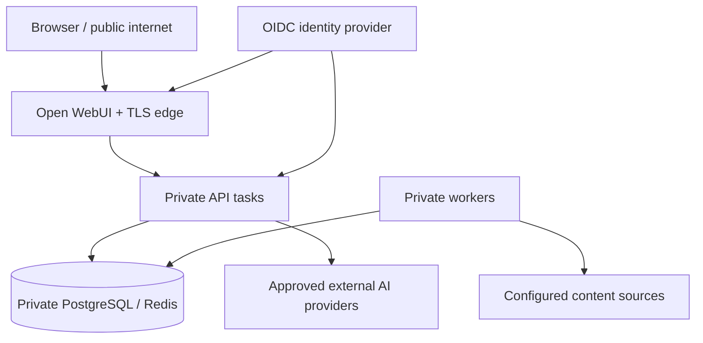

# Security model

## Invariants

1. A Chunk is eligible for retrieval only when its Document is currently available and at least one normalized Access Grant matches the verified Authorization Context.
2. Authorization occurs inside lexical and vector queries. Post-retrieval filtering is defense in depth, never the primary control.
3. Restrictive permission changes make content unavailable before background cleanup completes.
4. Retrieved content is untrusted data. It cannot grant tools, alter policy, or supply identity claims.
5. Raw questions, Evidence, and Answers are absent from production telemetry unless an explicit, audited diagnostic policy enables them.
6. Agent and MCP tool calls carry the initiating Authorization Context and are re-authorized server-side.
7. ACL leakage, including through citations, caches, traces, evaluation artifacts, or error messages, blocks a release.

## Trust zones

## Threat-driven controls

| Threat | Primary controls | Required evidence |
|---|---|---|
| Cross-user document leakage | verified JWT, group normalization, query-time ACL predicates | adversarial integration tests with indistinguishable documents |
| Stale access after revocation | separate Authorization Version, priority sync, transactional unavailability | revocation race test |
| Prompt injection in documents | evidence delimiting, fixed policy, read-only tools, output validation | injected-document evaluation cases |
| Citation spoofing | opaque Evidence IDs and server-side validation | unknown/mismatched citation tests |
| Sensitive telemetry | configurable redaction and metadata allowlist | log/trace capture assertions |
| Queue replay | idempotency keys and transactional state transitions | duplicate-delivery test |
| Denial of wallet | rate limits, token/cost budgets, workflow limits | load and limit tests |
| Supply-chain compromise | lockfile, provenance, scanning, minimal images, SBOM | CI artifacts and policy results |

## Application roles

- **User** asks questions and manages their retained Conversations.
- **Content manager** configures Sources and starts Synchronization Runs.
- **Evaluator** manages approved Evaluation Datasets and runs paid evaluation.
- **Administrator** manages policy and operational configuration.

Application Roles never imply Document access.
